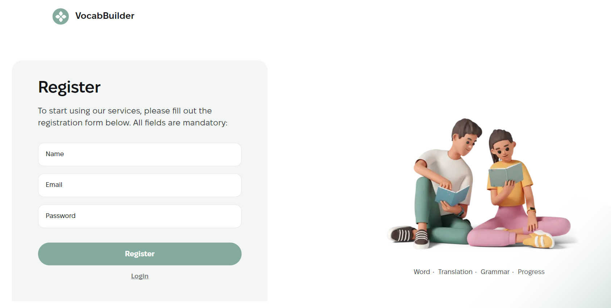
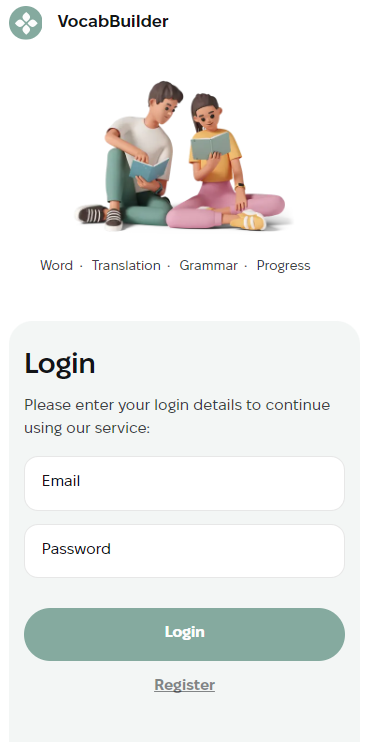
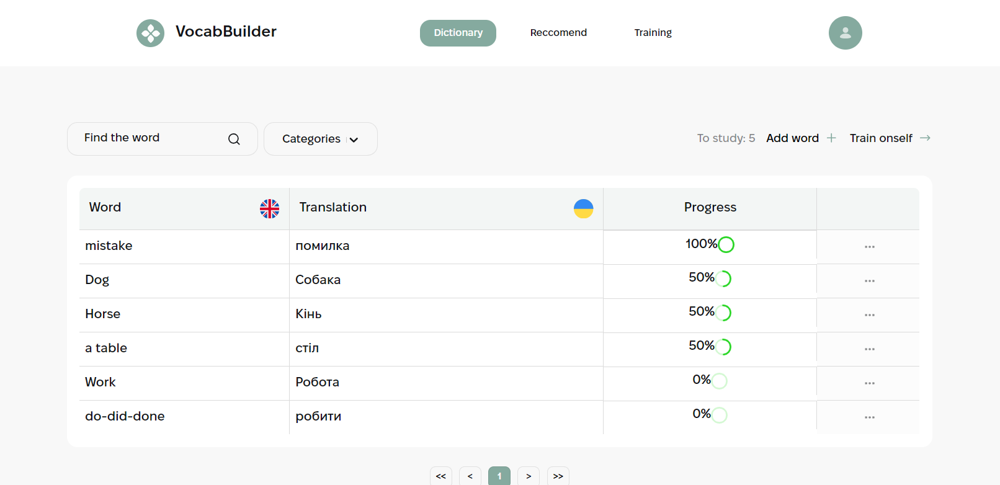
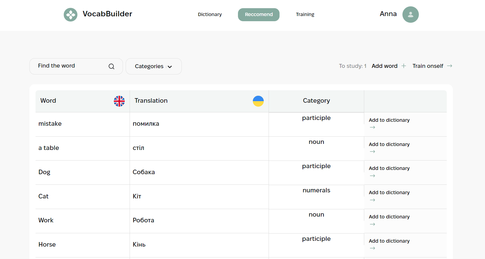
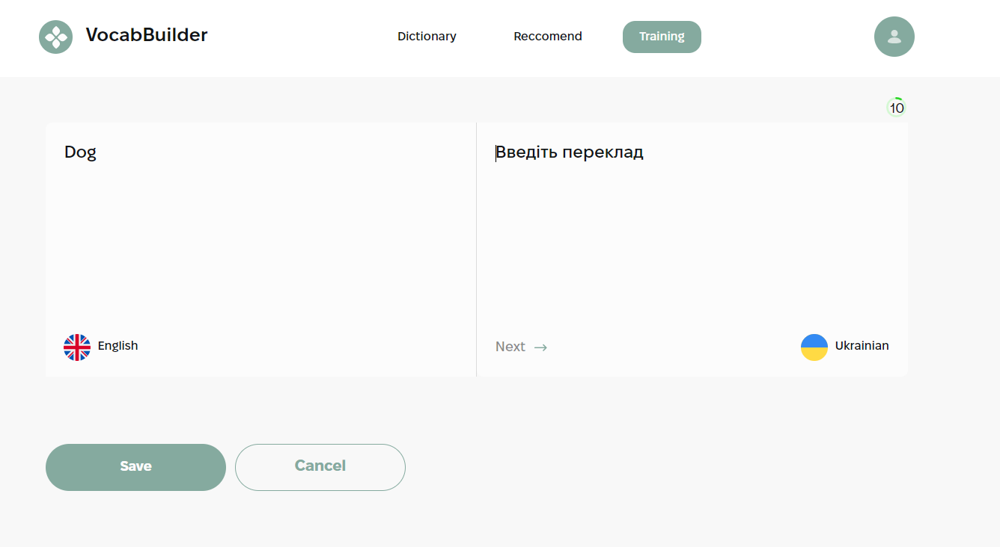

# VocabBuilder App




## Overview

VocabBuilder is a program designed to expand your vocabulary and language skills. With its help, you will be able to add and practice learning new words every day, tracking your progress. There are pages for this on the site "Register", 'Login", "Dictionary," "Recommend," and "Training." 

## Technologies Used

- React: The project is built using [Create React App](https://github.com/facebook/create-react-app).For acquaintance
and setting additional features refer to the [documentation](https://facebook.github.io/create-react-app/docs/getting-started).
- [Formik & Yup](https://formik.org/): Formik is employed for form management, and Yup is used for form validation.
- [React Router](https://reactrouter.com/en/main): React Router is utilized for client-side routing within the application.

## Pages

### Authorizations

Includes Login and Registration pages implemented and validated using libraries Formik & Yup

### Dictionary Page

The Dictionary Page ("/dictionary") allows users to efficiently manage their vocabulary learning process. It consists of such components as Dashboard, Words Table, Add/Edit Word Modals, Pagination

### Reccomend Page

The Recommend Page is designed to assist authenticated users in discovering new words tailored to their preferences and maintaining control over their vocabulary learning. It consists of the following components:Dashboard, Words Table, Pagination.


### Training Page

The Training Page ("/training") offers users a platform to engage in vocabulary training sessions. It comprises the following components:ProgressBar Componen and TrainingRoom Block, and WellDone Modal

## Technical Specifications

### Authorizations:
Realized private and public routes with the help of React Router library.

### Navigation:
On mobile and tablet versions, UserNav and UserBar are implemented in the form of a burger menu.

### Words Table:
Implemented using React Table.

Includes functionality for editing and deleting words.

Modal forms are closed after clicking the close button, background or pressing the Esc key and are implemented using portals

Visualizes the progress of learning a word using the react-progress library

### Training Room:
The ProgressBar component aids in visualizing the user's progress during training sessions.

Automatically navigates to the next task upon clicking the "Next" button.

Displays success or failure messages to the user based on the backend response.

Provides visual cues to the user for correct and incorrect responses

## Getting Started

To get started with this project, follow the installation instructions below.

## Installation

1. Clone the repository to your local computer
```bash
   git clone https://github.com/aniakurtiak/VocabBuilder
   cd vocabBuilder-app
   ```
2. Install the dependencies:
   ```bash
   npm install
   ```
3. Start the development server:
   ```bash
   npm start
   ``` 
4. Open
   [https://aniakurtiak.github.io/learnLingo/](https://aniakurtiak.github.io/VocabBuilder/dictionary)
   to view it in the browser.

